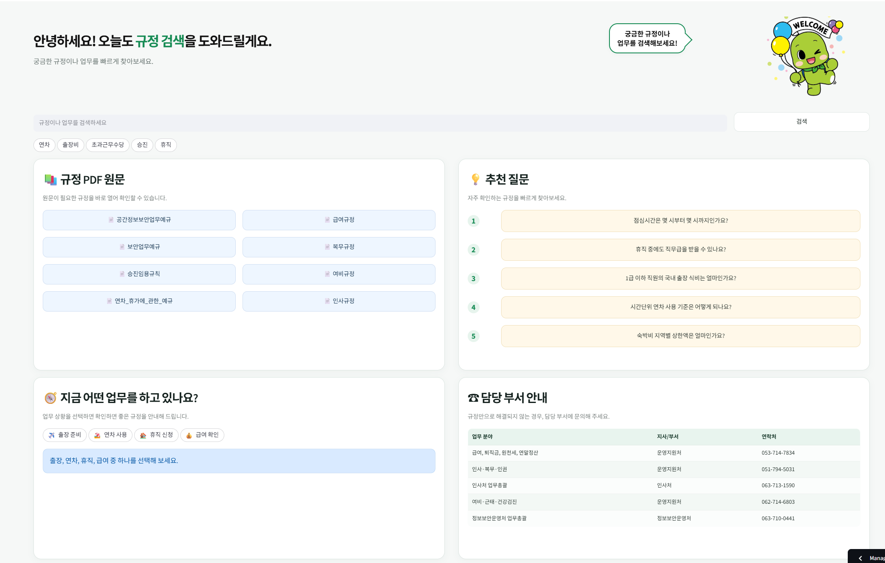
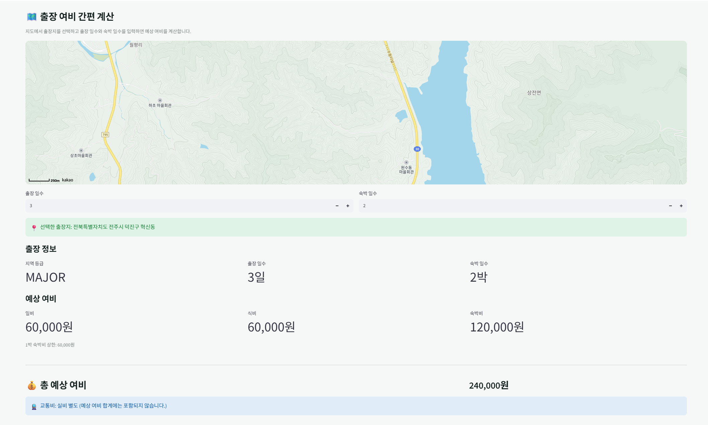
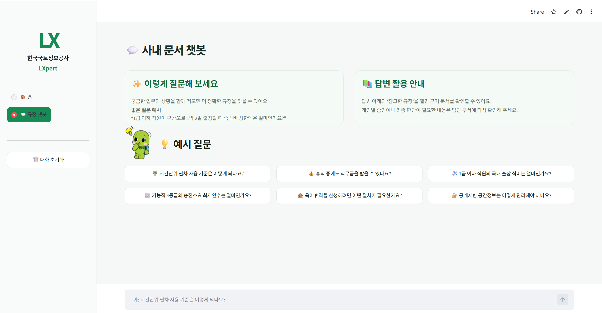
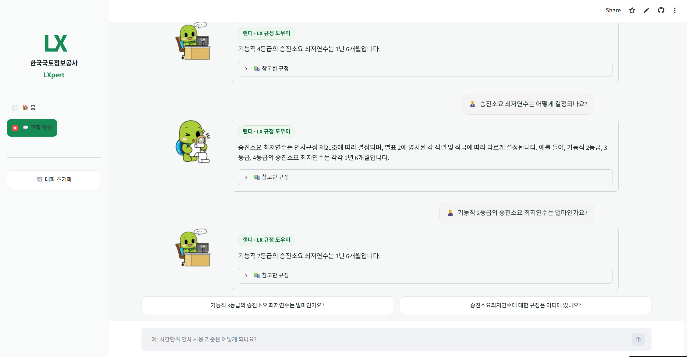
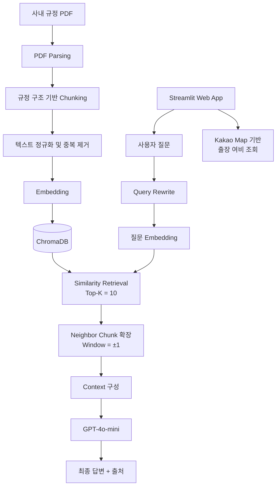

# Lxpert

> 한 줄 소개: 한국국토정보공사(LX)의 사내 규정 문서를 전처리·임베딩하여  
> 사용자의 질문과 관련된 규정을 검색하고, **근거 문서와 함께 답변하는 RAG 챗봇**과  
> **검색·질문 임베딩 분석 대시보드**를 하나의 Streamlit 앱으로 제공합니다.

🔗 데모: [LXpert 바로가기](https://mle-01-p1-team4-85shjgm8vqx98akldf2s46.streamlit.app/)

📓 팀 노션: [프로젝트 노션](https://app.notion.com/p/3b5fceb573c38114a20ecfe6ea86b228)

---

## 1. 프로젝트 소개

- **문제**: 사내 규정이 여러 PDF에 분산되어 있어 직원이 필요한 조항을 찾기 어렵고, 규정을 잘 모르는 경우 인사 담당 부서에 반복적으로 문의해야 합니다.
담당자 역시 규정 확인과 반복 답변에 시간이 소요되어 직원과 담당 부서 모두 업무 효율이 저하됩니다.

- **해결**: 사내 규정을 조·항·별표 단위로 청킹하고 ChromaDB에 저장해, 직원이 자연어 질문으로 필요한 규정을 빠르게 검색하도록 구현했습니다.
RAG 챗봇이 근거 규정과 출처를 함께 제공하고, 원문 조회·담당 부서 안내·분석 대시보드 기능을 하나의 Streamlit 앱에서 제공합니다.

- **기간 / 팀**: 2026.08.20 ~ 2026.08.24 (3일) / 3명

## 2. 데모

### 홈 화면 1



---

### 홈 화면 2



---

### 챗봇 화면 1



---

### 챗봇 화면 2



## 3. 주요 기능

### 규정 정보 대시보드
- 키워드 기반 사내 규정 통합 검색
- 규정 PDF별 원문 조회
- 직원들이 자주 묻는 추천 질문 Top 5 제공
- 출장·연차·휴직·급여 등 업무 상황별 관련 규정 안내
- 업무 분야별 담당 부서 및 전화번호 제공
- Kakao Maps API 기반 출장지 선택 및 예상 여비 계산

### 근거 기반 RAG 챗봇
- 사용자의 자연어 질문과 관련된 규정 검색
- 검색된 규정만 Context로 사용해 답변 생성
- 답변마다 실제 참고한 문서명·조문·별표 표시
- 근거를 찾지 못하면 관련 내용을 확인할 수 없다고 안내
- 대화 내용에 맞는 후속 추천 질문 제공
- 답변마다 랜디 캐릭터 이미지를 무작위로 표시

### 규정 문서 구조 반영
- 장·조·항 단위로 규정 본문 분할
- 일반 조문과 별표를 구분해 metadata 저장
- 조문에서 참조하는 관련 별표까지 검색 범위 확장
- 검색된 Chunk의 주변 문맥을 함께 조회
- 동일한 규정 출처가 반복되지 않도록 중복 제거

### 검색 품질 평가
- 정답 Chunk를 지정한 Golden Set 구축
- Hit@K, Precision@K, Recall@K, MRR 측정
- K값에 따른 검색 성능 비교
- 검색 정확도와 검색 문서 수 사이의 Trade-off 분석

---

## 4. 아키텍처

LXpert는 사내 규정 PDF를 전처리·청킹한 뒤 Vector DB에 저장하고, 사용자 질문과 유사한 규정 Chunk를 검색하여 LLM이 근거 기반 답변을 생성하는 RAG 구조로 구성하였다.



### RAG 처리 흐름

1. **문서 전처리**

   * PDF에서 장·조·항·별표 구조를 추출하고 의미 단위로 Chunk를 생성한다.
   * HTML, 표, 공백 등을 정규화하고 중복 데이터를 제거한다.

2. **Vector DB 적재**

   * `jhgan/ko-sroberta-multitask`로 Chunk를 임베딩하여 ChromaDB에 저장한다.

3. **검색 및 Context 구성**

   * 사용자 질문을 임베딩하여 유사한 Chunk를 `Top-K = 10`으로 검색한다.
   * 검색된 Chunk의 앞뒤 문맥을 `Window = ±1`로 확장한다.

4. **답변 생성**

   * 검색된 Context를 `GPT-4o-mini`에 전달하여 규정 기반 답변과 출처를 생성한다.

5. **서비스 제공**

   * Streamlit으로 챗봇을 제공하며, Kakao Map을 활용한 출장 여비 조회 기능도 함께 제공한다.


---

## 5. 기술 스택

| 구분                | 사용 기술                       | 활용                                  |
| ----------------- | --------------------------- | ----------------------------------- |
| **언어 / 환경**       | Python 3.12, uv             | 프로젝트 개발 환경 및 패키지 의존성 관리             |
| **데이터 처리**        | pandas                      | 데이터 전처리, 평가 데이터셋 및 실험 결과 분석         |
| **통계 / 분석**       | scipy, scikit-learn         | 통계 검정, TF-IDF, 임베딩 기반 분석 및 평가       |
| **LLM**           | OpenAI GPT-4o-mini          | 검색된 규정 Context 기반 최종 답변 생성          |
| **Embedding**     | jhgan/ko-sroberta-multitask | 한국어 규정 문서 및 사용자 질문 임베딩              |
| **RAG Framework** | LangChain                   | Retriever, RAG Chain 및 LLM 파이프라인 구성 |
| **Vector DB**     | ChromaDB                    | 규정 Chunk Vector 저장 및 유사도 검색         |
| **Web App**       | Streamlit                   | RAG 챗봇 및 통합 서비스 UI 구현               |
| **시각화**           | Plotly                      | 데이터 분석 결과 및 서비스 시각화                 |
| **외부 API**        | Kakao Maps API              | 지도 기반 출장 위치 선택 및 행정주소 활용            |
| **버전 관리 / 협업**    | GitHub                      | 브랜치 전략, Pull Request, 코드 리뷰 및 형상 관리 |
| **문서 / 협업**       | Notion, FigJam              | 프로젝트 일정, 데이터 명세, 아이디어 및 시스템 설계 공유   |

### 주요 기술 선정 기준

* **GPT-4o-mini**

  * RAG 답변 품질과 실제 서비스 응답 속도를 함께 고려하여 선정하였다.
  * 모델 비교 실험에서 상위 모델 대비 빠른 응답 속도를 보이면서도 본 프로젝트의 규정 질의응답에서 충분한 품질을 확보하였다.

* **jhgan/ko-sroberta-multitask**

  * 한국어 문장의 의미적 유사도 검색에 적합한 Sentence Embedding 모델로, 규정 문서와 자연어 질문 간 의미 기반 검색에 활용하였다.

* **ChromaDB**

  * 별도의 외부 Vector DB 인프라 없이 로컬 및 Streamlit 환경에서 비교적 간단하게 Persistent Vector Store를 구성할 수 있어 프로젝트 규모와 시연 환경에 적합하다고 판단하였다.

* **LangChain**

  * Embedding, Retriever, Prompt, LLM을 하나의 RAG Pipeline으로 연결하고 각 구성요소를 모듈화하기 위해 활용하였다.

* **Streamlit**

  * Python 기반 RAG 로직과 빠르게 통합할 수 있고 별도의 복잡한 Frontend 개발 없이 시연 가능한 Web Application을 구축할 수 있다는 점을 고려하여 선정하였다.

## 6. 데이터

* **출처**: ALIO(공공기관 경영정보 공개시스템)의 한국국토정보공사(LX) 사내 규정 PDF

* **문서 수**: 8종

* **최종 데이터**: 전처리 후 **836 Chunk**

* **주요 컬럼**: `document_name`, `article_no`, `paragraph`, `chunk_type`, `page_content`

* **전처리 요약**

  * 장·조·항·별표 구조를 기준으로 Chunk 생성
  * 별표·비고 등 특수 영역 분리
  * HTML 태그 및 불필요한 공백·줄바꿈 정리
  * 표 데이터를 검색 가능한 텍스트 형태로 변환
  * 중복 Chunk 제거 및 메타데이터 보강
  * 문서 구조 정보와 본문을 결합해 최종 `page_content` 생성

* **Vector DB**

  * Embedding: `jhgan/ko-sroberta-multitask`
  * Vector DB: `ChromaDB`
  * Collection: `company_regulations`

- **상세 명세**: [데이터 명세서] · [전처리 명세서](https://docs.google.com/spreadsheets/d/197W6lic5dUboYwtyhnOOJ67f3-Ayru6CUputlX0FJdM/edit?usp=sharing)

## 7. 실행 방법

### 사전 준비

- Python 3.12, [uv](https://docs.astral.sh/uv/)
- OpenAI API Key ([발급](https://platform.openai.com/api-keys))

### 설치

    git clone https://github.com/encore-ai-campus/mle-01-p1-team4
    cd REPO
    uv sync

### 환경 변수

`.env.example`을 복사해 `.env`를 만들고 키를 채웁니다. `.env`는 커밋하지 않습니다.

    OPENAI_API_KEY=your_key_here

### 수집 → 인덱싱 → 실행
    후처리:      uv run python src/preprocessing/chunk_postprocess.py
    Chroma 적재: uv run python src/rag/ingest.py
    앱 실행:     uv run streamlit run app.py

## 8. 프로젝트 구조

```text
mle-01-p1-team4/
│
├── app.py                          # Streamlit 통합 앱
├── README.md
├── pyproject.toml                  # 프로젝트 의존성 설정
├── requirements.txt
│
├── analysis/
│   └── embedding_analysis.py       # 임베딩 및 데이터 분석
│
├── assets/
│   └── *.png                       # 랜디 캐릭터 이미지
│
├── chroma/
│   └── ko-sroberta/                # ChromaDB 영구 저장소
│
├── data/
│   ├── raw/
│   │   └── *.pdf                   # 원본 사내 규정 PDF 8종
│   │
│   ├── processed/
│   │   └── llama_parsed/
│   │       ├── 전체_문서_chunks.json
│   │       └── 전체_문서_chunks_normalized.json
│   │
│   └── images/
│       └── *.png                   # 서비스 화면 이미지
│
├── evaluation/
│   ├── evaluate_retriever.py       # Hit@K · Precision · Recall · MRR 평가
│   ├── golden_set.csv              # 검색 품질 평가 데이터셋
│   ├── test_rag_manual.py          # RAG 응답 수동 평가
│   │
│   └── results/
│       └── *.csv                   # Top-K · 모델별 실험 및 평가 결과
│
├── scripts/
│   ├── llama_parser.py             # PDF 파싱 및 초기 Chunk 생성
│   └── test_similarity_search.py   # 유사도 검색 테스트
│
├── src/
│   ├── config.py                   # 공통 경로 및 환경 설정
│   │
│   ├── preprocessing/
│   │   ├── legal_chunking.py       # 규정 구조 기반 Chunking
│   │   └── chunk_postprocess.py    # 정규화 · 중복 제거 · 후처리
│   │
│   ├── rag/
│   │   ├── ingest.py               # 임베딩 및 ChromaDB 적재
│   │   ├── retriever.py            # 유사도 검색 및 Neighbor 확장
│   │   ├── query_rewriter.py       # 멀티턴 질문 재작성
│   │   ├── rag_chain.py            # RAG Chain 구성
│   │   ├── source.py               # 답변 출처 구성
│   │   └── chatbot.py              # 챗봇 동작 로직
│   │
│   ├── services/
│   │   ├── kakao_map.py            # Kakao Map API 연동
│   │   └── travel_expense.py       # 출장 여비 계산
│   │
│   └── ui/
│       ├── home.py                 # 홈 화면 UI
│       └── chat_ui.py              # 챗봇 UI
│
└── tests/
    ├── test_chunk_postprocess.py    # 전처리 테스트
    └── test_retriever.py            # Retriever 테스트
```

> `.env`, 가상환경, 캐시 파일 및 ChromaDB 백업 파일 등은 프로젝트 구조에서 생략하였다.


## 9. 검색 품질 평가

평가셋: 정답 Chunk를 지정한 **85개 질문** (`evaluation/golden_set.csv`)

| 실험    |     Hit@K | Precision@K |  Recall@K |     MRR@K | 비고         |
| ----- | --------: | ----------: | --------: | --------: | ---------- |
| 기본 설정 |     0.788 |       0.267 |     0.771 |     0.700 | Top-K = 3  |
| 최종 설정 | **0.894** |       0.092 | **0.882** | **0.719** | Top-K = 10 |

**개선 실험(M7)**: Top-K가 낮을 경우 정답 Chunk가 검색 결과에서 누락되는 문제가 있어 `K=3~10` 구간을 비교하였다.
K를 10으로 확장하면서 Precision은 감소했지만, RAG에서 중요하게 판단한 **Hit@K와 Recall@K가 각각 0.894, 0.882까지 향상**되어 최종 `Top-K=10`을 적용하였다.

재현:

```bash
uv run python evaluation/evaluate_retriever.py
```

상세 실험 결과는 `evaluation/results/`에서 확인할 수 있다.


## 10. 팀 소개

| 이름 | 역할 | 담당 | GitHub |
| --- | --- | --- | --- |
| 이범준 | PM | M0 기획 · 일정 · M9 시연 · M8 통합 앱 · 시각화| github.com/beomjunlee0427 |
| 조현영 | 데이터 | M1 수집 · M2 전처리 · M3 분석 · M8 통합 앱 · 시각화| github.com/nyoungs00 |
| 이유진 | RAG | M4 적재 · M5 체인 · M6·M7 평가 · M8 통합 앱 · 시각화| github.com/Leeyoujin0312 |

## 11. 회고 (KPT)

팀원별로 프로젝트를 진행하며 잘된 점(Keep), 아쉬웠던 점(Problem), 다음 프로젝트에서 시도해보고 싶은 점(Try)을 정리하였다.

---

### 👤 이범준

#### ✅ Keep

챗봇 구현 과정에서 **Multi-turn 기능을 적용하여 이전 대화의 맥락을 이어갈 수 있도록 개선**하고, 검색 품질을 높이기 위해 **Top-K 값을 단계적으로 조절하며 Hit@K, Recall@K, MRR@K 등의 지표를 비교**하였다.

단순히 기능 구현에 그치지 않고 **실제 평가 결과를 바탕으로 RAG 파이프라인의 성능을 개선**해 본 경험을 계속 이어가고 싶다.

#### ⚠️ Problem

문서 파싱·청킹·검색·UI를 동시에 개발하면서 기능이 추가될수록 **모듈 간 의존성과 배포 환경에서의 오류를 관리하는 데 어려움**이 있었다.

또한 실제 사내 챗봇의 사용자 질문 데이터가 없어 평가 데이터셋을 직접 구성해야 했으며, **검색 성능을 실제 사용자 관점에서 충분히 검증하기에는 한계**가 있었다.

#### 🚀 Try

향후에는 실제 사용자 질문 로그를 활용해 **보다 현실적인 평가 데이터셋을 구축**하고, Top-K 조절뿐만 아니라 **Reranking, Hybrid Search, 임베딩 모델 비교** 등 다양한 검색 개선 방법을 실험해 보고 싶다.

또한 개발 초기부터 **기능별 모듈과 테스트를 명확히 분리**하여 기능 추가나 배포 과정에서 발생하는 오류를 줄여보고자 한다.

---

### 👤 이유진

#### ✅ Keep

기능별로 역할을 나누고 각자 브랜치에서 작업한 뒤 PR을 통해 코드를 합치는 방식으로 협업하면서, 여러 기능을 동시에 개발해도 작업 내용을 비교적 명확하게 관리할 수 있었다.

또한 **Golden Set과 평가 지표를 활용해 검색 성능을 직접 확인**한 점도 좋았다.  
**Task Board를 통해 각자의 진행 상황과 수정 내용을 공유**한 방식도 앞으로의 팀 프로젝트에서 계속 활용하면 좋을 것 같다.

#### ⚠️ Problem

조·항·별표 등을 일정한 기준으로 전처리하고 메타데이터를 정리하는 과정에서 예상보다 많은 시간이 필요했다.

RAG 검색에서도 **실제 정답과 다른 규정이 검색되는 경우가 있어 검색 품질을 조정하는 데 어려움**이 있었다.

또한 Streamlit으로 처음 잡았던 디자인 시안을 최대한 비슷하게 구현하려다 보니 CSS와 화면 배치를 여러 번 수정해야 했고, **예상보다 UI 작업에 많은 시간이 소요**되었다.

#### 🚀 Try

UI 구현 단계에서 계속 수정하기보다, 초기에 **Streamlit에서 실제로 구현 가능한 수준까지 레이아웃과 공통 스타일을 먼저 정의**하면 개발 시간을 줄일 수 있을 것 같다.

RAG 측면에서는 **실제 사용자 질문을 더 많이 확보해 평가셋을 확장**하고, Top-K 조정 외에도 다양한 검색 개선 방법을 적용해 **검색 정확도를 더 높여보고 싶다.**

---

### 👤 조현영

#### ✅ Keep

답변과 함께 **참고한 문서명·조문·별표를 표시**해 사용자가 근거 규정을 직접 확인할 수 있도록 한 점이 좋았다.

또한 **Golden Set을 직접 구축하고 Hit@K, Precision@K, Recall@K, MRR을 측정**하면서, 자연스러운 답변 생성보다 **정확한 규정 검색이 먼저 이루어져야 한다는 점**을 확인할 수 있었다.

#### ⚠️ Problem

규정 PDF마다 구조가 달라 **표와 별표를 파싱하는 과정에서 내용이 분리되거나 순서가 바뀌는 문제**가 발생했고, 이로 인해 일부 질문에 대해 적절한 답변을 생성하지 못하는 경우가 있었다.

또한 여러 사람이 동시에 Git을 사용하면서 **Pull·Rebase·충돌 해결 과정**에서 어려움을 겪었고, **로컬 코드와 배포 코드의 차이**로 인해 예상하지 못한 오류가 발생하기도 했다.

#### 🚀 Try

다음에는 **일반 조문·표·별표의 구조에 따라 청킹 방식을 구분**하고, 파싱 결과에 문제가 없는지 확인할 수 있는 **자동 검증 과정**을 추가하고 싶다.

또한 실제 사용자 질문과 피드백을 활용해 평가셋을 확장하고, **검색 정확도·출처 일치도·응답 시간·API 비용**까지 함께 평가하여 RAG 시스템을 보다 종합적으로 개선해 보고 싶다.